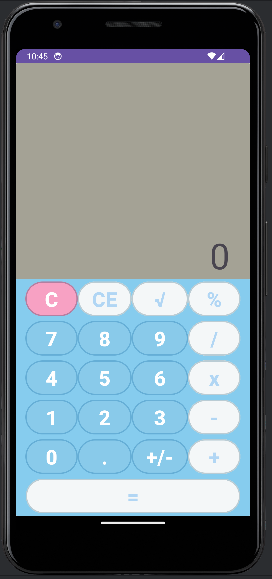
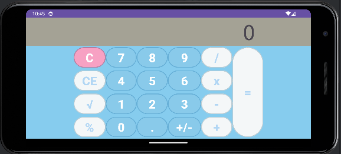

# Calculator-App
This is a simple calculator application that allows users to perform basic arithmetic operations including addition, subtraction, multiplication, division, modulus, and square root. It supports positive and negative real numbers.

## Features
- Addition (+)
- Subtraction (-)
- Multiplication (x)
- Division (/)
- Modulus (%)
- Square Root (√)
- Clear options:
  - C: Clears the entire display screen and the current calculation.
  - CE: Clears the most recent entry (e.g., the last digit entered).

## User Interface
The user interface closely resembles a basic calculator, with buttons for each digit and operation. The user interface for both portrait and landscape mode is shown below:

### Portrait Mode

### Landscape Mode

## Implementation Details
- The application is built using fragments, with one fragment for the top display and one for the bottom buttons.

## Development Environment
- IDE: Android Studio Hedgehog | 2023.1.1 Patch 2
- Language: Kotlin
